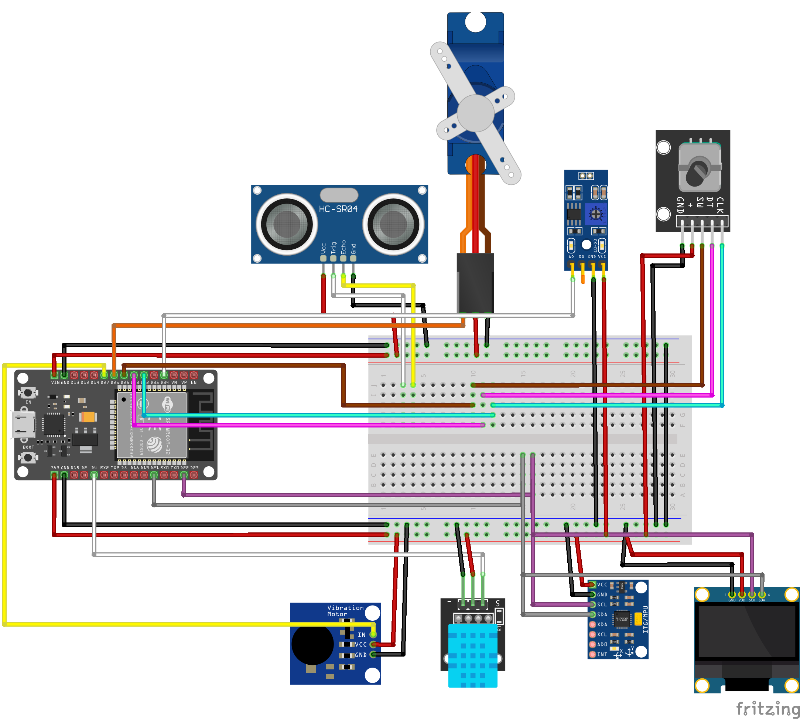
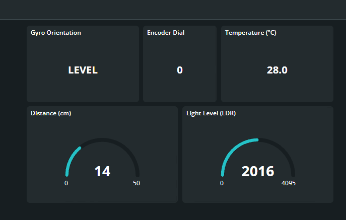
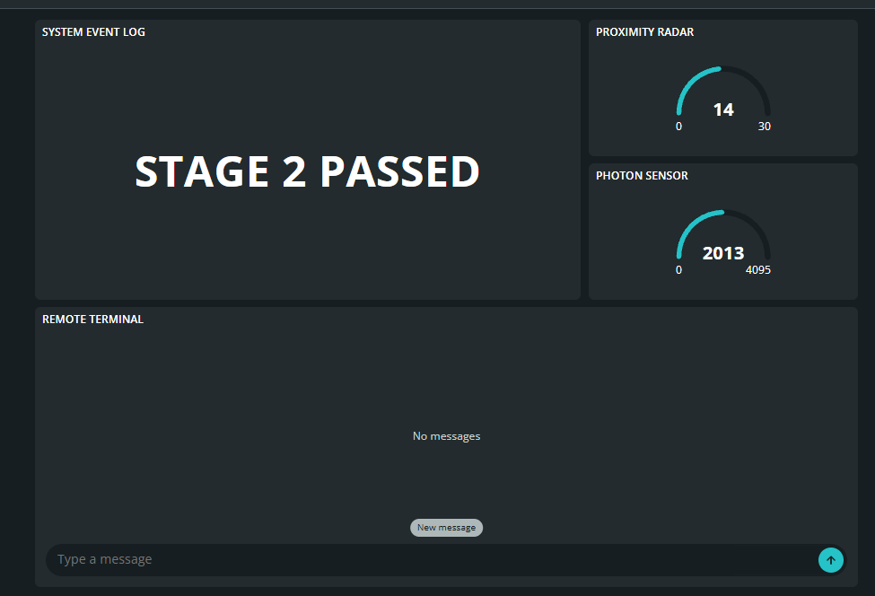

# OmniDeck: An Asymmetric IoT Puzzle Platform

## Project Summary
OmniDeck is an innovative, asymmetric cooperative IoT hardware platform designed to merge physical puzzles with digital cloud-based mechanics—creating a "Keep Talking and Nobody Explodes" style escape room experience. Acting as a "Dumb Terminal," the physical device utilizes an ESP32 to read environmental and interactive telemetry (spatial orientation, rotational vault-cracking inputs, proximity, temperature, and light intensity) and publishes this data to the Arduino IoT Cloud in real-time via WebSockets. A remote "Hacker" monitors these live feeds on a web dashboard and transmits haptic (vibration) clues and game-stage commands back to the console. The cloud platform functions as the ultimate Game Master, orchestrating a complete Sense-Think-Act cycle where the physical hardware is fully decoupled from the game logic, eventually releasing a mechanical servo-latch upon successful cooperation.

## Components List
Our project exceeds the minimum requirements (2 sensors + OLED + 1 actuator) by utilizing a comprehensive ecosystem of components:
*   **Microcontroller:** ESP32 Development Board (ESP-WROOM-32)
*   **Display:** 0.96" I2C OLED Display (128x64)
*   **Sensor 1:** MPU6050 (Accelerometer/Gyroscope)
*   **Sensor 2:** KY-040 (Rotary Encoder with Push Button)
*   **Sensor 3:** HC-SR04 (Ultrasonic Distance Sensor)
*   **Sensor 4:** DHT11 (Temperature & Humidity Sensor)
*   **Sensor 5:** 4-Pin LDR (Light Dependent Resistor Module)
*   **Actuator 1:** SG90 Micro Servo Motor
*   **Actuator 2:** Vibration Motor Module

## Wiring Table & Diagram

| Component | Component Pin | ESP32 GPIO Pin | Notes |
| :--- | :--- | :--- | :--- |
| **OLED Display** | SDA / SCL | GPIO 21 / GPIO 22 | I2C Bus (3.3V) |
| **MPU6050** | SDA / SCL | GPIO 21 / GPIO 22 | I2C Bus (3.3V) |
| **KY-040 Encoder** | CLK / DT / SW | GPIO 32 / 33 / 25 | Hardware Interrupt (3.3V) |
| **HC-SR04** | TRIG / ECHO | GPIO 5 / GPIO 18 | 5V VIN Powered |
| **DHT11** | DATA (S) | GPIO 4 | 3.3V Powered |
| **LDR Module** | A0 (Analog) | GPIO 34 | Analog Input (3.3V) |
| **SG90 Servo** | SIGNAL (Orange) | GPIO 26 | 5V VIN Powered |
| **Vibration Motor**| IN (Signal) | GPIO 27 | 3.3V Powered |

### Wiring Diagram

  
   
  <i>Figure 1: Complete wiring diagram showing ESP32, sensors, and actuators. 5V and 3.3V logic levels are separated via breadboard power rails.</i>

## Cloud Setup (Arduino IoT Cloud)

*   **Cloud Platform:** Arduino IoT Cloud
*   **Network:** Wi-Fi connected via ESP32.
*   **Cloud Variables (Feeds):**
    *   `dist` (Integer, Read Only, On Change)
    *   `temp` (Floating Point, Read Only, On Change)
    *   `light` (Integer, Read Only, On Change)
    *   `tilt` (Character String, Read Only, On Change)
    *   `dial` (Integer, Read Only, On Change)
    *   `game_log` (Character String, Read Only, On Change)
    *   `hacker_cmd` (Character String, Read & Write, On Change) - *Triggers callback function.*
*   **Dashboard Widgets:**
    *   **Monitoring:** Gauges for Distance & Light, Value widgets for Temp, Tilt, Dial, and a wide Value widget for the `game_log`.
    *   **Control:** String Input / Messenger widget linked to `hacker_cmd` for sending remote terminal commands (e.g., STAGE1, STAGE2, VIB, OPEN).

## How to Run

1.  **Libraries Required:** Install the following via Arduino IDE Library Manager:
    *   `Adafruit GFX Library`
    *   `Adafruit SSD1306`
    *   `Adafruit MPU6050` & `Adafruit Unified Sensor`
    *   `DHT sensor library`
    *   `ESP32Servo`
    *   `ArduinoIoTCloud` & `Arduino_ConnectionHandler`
2.  **Board Settings:** Select **DOIT ESP32 DEVKIT V1** in the Arduino IDE.
3.  **Network Configuration:** In the Arduino Cloud Web Editor, navigate to the `Secret` tab or `arduino_secrets.h` and input your `SECRET_SSID` (Wi-Fi Name) and `SECRET_PASS` (Wi-Fi Password).
4.  **Upload:** Connect the ESP32 via USB and upload the sketch.

## How it Works (Logic & Data Flow)

The system operates on a rapid **Sense-Think-Act** loop synchronized with the cloud via WebSockets:
1.  **Data Upload (Sense & Think):** Every 100ms, the ESP32 reads local hardware (converting MPU vectors to directional strings like "RIGHT", interpreting the LDR light intensity, etc.). The Rotary Encoder uses a hardware interrupt (`IRAM_ATTR`) to guarantee zero-latency turning. Variables are automatically pushed to the Arduino Cloud upon any change.
2.  **Dashboard Control Logic (Act):** The Hacker observes the live sensor data on the dashboard and issues game-progression commands via the `hacker_cmd` terminal. 
    *   When the Hacker sends a command (e.g., `"STAGE1"` or `"VIBLONG"`), the cloud pushes this value to the ESP32.
    *   The `onHackerCmdChange()` callback function is triggered locally on the ESP32, which then alters the game state, updates the OLED prompt zone, or actuates the hardware (moving the SG90 servo to lock/unlock, or pulsing the vibration motor for Haptic Morse Code).
3.  **Local UI:** The OLED is hardcoded to represent 3 functional zones: The Status Bar (Network/Cloud state), the Interaction Zone (Sensor readouts and a dynamic inclinometer ball), and the Prompt Zone (Real-time remote commands).

## Evidence

### Dashboard Screenshots

  
   
  <i>Figure 2: "Academic Overview" dashboard displaying real-time telemetry from all 5 sensors to meet project requirements.</i>

  
   
  <i>Figure 3: "The Blind Heist" Mission Control terminal. Used by the Hacker to send remote commands (STAGE1, OPEN, VIB) and monitor live game logs.</i>

### Demonstration
Watch the full functionality and game demo here:
**[▶️ Click here to watch the OmniDeck Demo Video on YouTube/Drive] (#)** 
*(Note: Link will be updated before the presentation).*
